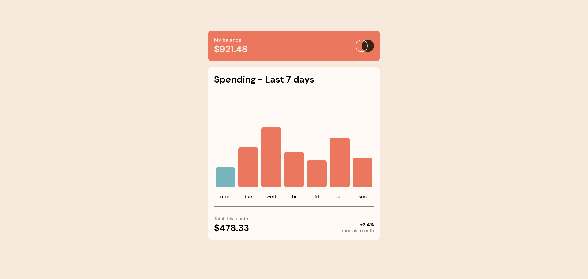
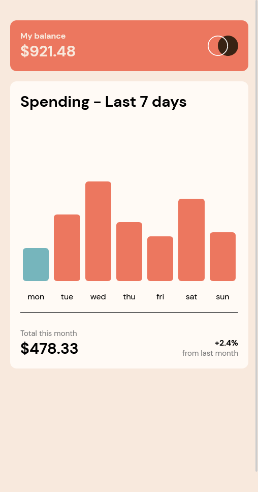

# Frontend Mentor - Expenses chart component solution

This is a solution to the [Expenses chart component challenge on Frontend Mentor](https://www.frontendmentor.io/challenges/expenses-chart-component-e7yJBUdjwt). Frontend Mentor challenges help you improve your coding skills by building realistic projects. 

## Table of contents

- [Overview](#overview)
  - [The challenge](#the-challenge)
  - [Screenshot](#screenshot)
  - [Links](#links)
- [My process](#my-process)
  - [Built with](#built-with)
  - [What I learned](#what-i-learned)
  - [Continued development](#continued-development)
  - [Useful resources](#useful-resources)
- [Author](#author)


**Note: Delete this note and update the table of contents based on what sections you keep.**

## Overview

### The challenge

Users should be able to:

- View the bar chart and hover over the individual bars to see the correct amounts for each day
- See the current day’s bar highlighted in a different colour to the other bars
- View the optimal layout for the content depending on their device’s screen size
- See hover states for all interactive elements on the page
- **Bonus**: Use the JSON data file provided to dynamically size the bars on the chart

### Screenshot






### Links


- Live Site URL: [Add live site URL here](https://your-live-site-url.com)

## My process

### Built with

- Semantic HTML5 markup
- CSS custom properties
- Flexbox
- CSS Grid
- Mobile-first workflow


**Note: These are just examples. Delete this note and replace the list above with your own choices**

### What I learned

Use this section to recap over some of your major learnings while working through this project. Writing these out and providing code samples of areas you want to highlight is a great way to reinforce your own knowledge.

To see how you can add code snippets, see below:

```html
<!DOCTYPE html>
<html lang="en">
<head>
  <meta charset="UTF-8">
  <meta name="viewport" content="width=device-width, initial-scale=1.0"> <!-- displays site properly based on user's device -->

  <link rel="icon" type="image/png" sizes="32x32" href="./images/favicon-32x32.png">
  <link rel="stylesheet" href="style.css" />
  <script src="script.js"></script>
  <title>Frontend Mentor | Expenses chart component</title>

 
</head>
<body>

  <main id="card">

    <div id="section-1">
      <div id="balance-component">
        <h1 id="balance-title">My balance</h1>
        <h2 id="balance-money">$921.48</h2>
      </div>
      <div id="svg">

      </div>
    </div>
    <div id="section-2">
      <h1 id="spending-title">
        Spending - Last 7 days
      </h1>
      <div id="chart">
        <!-- <div class="col">
          
          <div class="col-money">
            $52.36
          </div>
          <div class="col-size">
            
          </div>
          <div class="col-name">
            mon
          </div>
         
        </div> -->
      </div>
      <hr>
      <div id="total">
        <div class="column-1">
          <h4 id="total-month">
            Total this month
          </h4>
          <h1 id="total-month-money">
            $478.33
          </h1>
        </div>
        <div class="column-2">
          <h1 id="pasentage-money">
            +2.4%
          </h1>
          <p id="last-month"> from last month</p>
        </div>
       
      </div>
    </div>
  </main>
 
</body>
</html>```
```css
@import url('https://fonts.googleapis.com/css2?family=DM+Sans:wght@400;700&display=swap');
body{
    background-color : hsl(27, 66%, 92%);
    height: 100vh;
    font-family: 'DM Sans', sans-serif;
}

*{
    margin: 0;
    padding: 0;
}
#card{
    margin :  2rem 1rem;
    background-color : hsl(27, 66%, 92%);
    display: flex;
    flex-direction: column;
    row-gap: 1rem;
    min-width: 350px;
    max-width: 450px;
}

#section-1{
    background-color: hsl(10, 79%, 65%);
    display: flex;
    padding: 1rem;
    height: 3rem;
    border-radius: 10px;
}

#balance-component{
    width: 100%;
}
#balance-title{
    font-size : 0.8rem;
    color : hsl(27, 66%, 92%)
}
#balance-money{
    color :hsl(27, 66%, 92%)
}

#svg {
    content: url('./images/logo.svg');
    height : 3rem;
    width: 3rem;
}
#section-2{
    background-color: hsl(33, 100%, 98%);
    padding: 1rem;
    border-radius: 10px;
}

#chart{
    margin-bottom: 1rem;
    height: 300px;
    display: flex;
    align-items: end;
}
.col{
    display: flex;
    flex-direction: column;
    align-items: center;
    justify-content: end;
    height: 100%;
    margin: 0 4px;
    width: 100%;
}

.col-name{

    font-size: 0.8rem;

}

.col-money{
    display: none;
    background-color: black;
    color : white;
    font-size: 0.7rem;
    padding : 0.3rem;
    border-radius: 4px;
    margin-bottom: 10px;
}


.col-size{
    background-color:  hsl(10, 79%, 65%);
    border-radius: 5px;
    min-width: 35px;
    width: 100%;
    max-width: 55px;
    height: 100px;
    margin-bottom : 1rem;
    cursor: pointer;
    transition: all;
    transition-duration: 1s;

}
.col-size:hover {
    background-color: hsla(10, 79%, 65%, 0.537);
}

#spending-title{
    font-size : 1.5rem;
    font-weight: 700;
}


.column-2{
    text-align: right;
}

#total{
    font-size: 12px;
    display: flex;
    align-items: end;
    justify-content: space-between;
    margin-top : 1.5rem;
 
    
}
#total-month{
    font-weight: 100;
    color: rgb(126, 126, 126);
}

#total-month-money{
    font-size: 1.5rem;
    font-weight: 700;
}
#pasentage-money{
    font-size : 0.8rem;
    font-weight: 700;
}
#last-month{
    font-weight: 100;
    color: rgb(126, 126, 126);
}


@media only screen and (min-width: 700px) {
   #card{
    margin:  5rem auto;
   }
    

}
```
```js


async function generateChart(){

    const chartData = await fetch('./data.json');
    const response = await chartData.json();
    console.log(response);

    const chartDivElement = document.getElementById('chart');

    const today = new Date();
    for(let i=0; i<response.length; i++){

        const colElement = document.createElement('div');
        colElement.className = "col"
        const colMoneyElement = document.createElement('div');
        colMoneyElement.className = "col-money";
        const colSizeElement = document.createElement("div");
        colSizeElement.className = 'col-size';
        const colNameElement = document.createElement('div');
        colNameElement.className = 'col-name';


        colNameElement.innerText = response[i].day
        colMoneyElement.innerText =  "$" + response[i].amount;
        colSizeElement.style.height = response[i].amount + "%";
        if(today.getDay() == i+1){
            colSizeElement.style.backgroundColor = "hsl(186, 34%, 60%)";
        }
        // console.log(response[i].amount*100/100)

        colSizeElement.addEventListener('mouseover',function(){
            colMoneyElement.style.display = "block"
        })
        colSizeElement.addEventListener('mouseleave',function(){
            colMoneyElement.style.display = "none"
        })

        colElement.append(colMoneyElement);
        colElement.append(colSizeElement);
        colElement.append(colNameElement)

        chartDivElement.append(colElement);
    }


    


}

generateChart();
```

## Author

- Website - [Add your name here](https://www.your-site.com)
- Frontend Mentor - [@sayyedaaman2](https://www.frontendmentor.io/profile/sayyedaaman2)
- Twitter - [@SayyedAaman](https://www.twitter.com/SayyedAaman)


